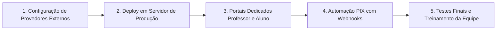

# Escopo Geral do Projeto — Pop Music

**Academia de Música Pop Music**  
**Documento:** Relatório Executivo de Escopo, Arquitetura, Decisões e Próximos Passos  
**Data:** Agosto / 2026  
**Status do Projeto:** Fase de Homologação / Pronto para Produção (100% Compilado e Validado)  

---

## 1. Resumo Executivo

O projeto **Pop Music** consiste em uma plataforma web completa para a gestão integrada da Academia de Música Pop Music, englobando desde a captação e matrícula de alunos com **assinatura eletrônica biométrica facial**, até o controle financeiro (mensalidades, fluxo de caixa, recibos timbrados e repasses de professores), diário de frequência e agendamento de aulas.

---

## 2. O Que Foi Feito (Entregas e Funcionalidades)

### 2.1 Módulo de Matrícula & Contratos Inteligentes
- **Matrícula Unificada:** Criação do aluno, responsável, seleção de turmas/modalidades e geração instantânea de contrato.
- **Envio Automático por E-mail:** Ao salvar a matrícula, um link exclusivo com token de segurança é enviado para o signatário.
- **Assinatura com Biometria Facial:**
  - Captura exclusiva ao vivo pela câmera/WebCam (bloqueio total de upload de fotos de galeria).
  - Validador facial inteligente por IA para evitar fotos impróprias ou sem rosto humano nítido.
  - Gravação de trilha de auditoria digital: IP, carimbo de data/hora, hash SHA-256 e foto facial segura.
- **Pós-Assinatura Automática:** Ao assinar o contrato, o sistema ativa a matrícula, aloca o aluno na turma e na agenda do professor e gera as 12 parcelas mensais no financeiro.
- **Impressão Isolada A4:** Mecanismo de impressão em folha A4 timbrada oficial da Pop Music via iframe limpo, sem elementos residuais da tela ou do dashboard.

### 2.2 Módulo Financeiro & Fluxo de Caixa
- **Cálculo de "A Receber Este Mês":** Ajustado para somar **apenas as parcelas do mês atual** (R$ 180,00), eliminando a soma indevida do total anual acumulado.
- **Ordenação Inteligente de Cobranças:** Filtros em abas rápidas que priorizam: 1º Em atraso, 2º Mês atual, 3º Parcelas futuras (1, 2, 3, 4...) e 4º Quitadas.
- **Recibos Oficiais Timbrados Pop Music:**
  - Emissão automática ao quitar cobranças.
  - Comprovante timbrado com CNPJ (12.811.326/0001-88), endereço, valor por extenso gerado dinamicamente e autenticação digital.
  - Ações rápidas de **Imprimir / PDF**, envio formatado por **WhatsApp** e reenvio por **E-mail**.
- **Repasses de Professores:**
  - Cálculo automático de comissões baseado em turmas ativas e chamadas registradas.
  - Botão "Marcar tudo como pago" que registra quitação em `repasses_professor` e lança a saída financeira no `fluxo_caixa`.
- **Fluxo de Caixa & Contas:** Extrato de entradas e saídas com categorização automática e manual.

### 2.3 Diário de Frequência & Agenda
- **Diário de Frequência:**
  - Filtro por dia da semana (`Hoje`, `Segunda`, `Terça`, `Quarta`, `Quinta`, `Sexta`, `Sábado`, `Todas`).
  - Cards de turmas com seleção e carregamento da chamada em 1 clique.
  - Registro de Presença, Falta, Justificativa com reposição e suporte a check-in por QR Code.
- **Agenda:**
  - Grade visual semanal expandida das **08:00 às 21:00**, acomodando turmas matutinas, vespertinas e noturnas.

---

## 3. Por Que Foi Feito (Motivações e Benefícios de Negócio)

| Problema Identificado | Solução Implementada | Impacto / Benefício |
|---|---|---|
| Contratos impressos em papel geravam lentidão e risco de perda. | Assinatura digital biométrica via WebCam com link por e-mail. | Matrícula 100% digital, jurídica e concluída em menos de 2 minutos. |
| Risco de envio de fotos falsas ou impróprias no contrato. | Bloqueio de upload manual + Validador Facial por IA. | Segurança jurídica e integridade cadastral à prova de fraudes. |
| Impressão do navegador puxava o dashboard e menus de fundo. | Impressão isolada em iframe A4 padronizado. | Documento timbrado e limpo pronto para impressão ou PDF. |
| "A receber este mês" exibia R$ 1.980,00 (12 meses somados) em vez de R$ 180,00. | Filtro estrito de data do mês corrente no cálculo. | Métrica de faturamento mensal precisa e confiável para a gestão. |
| Demora para emitir comprovantes e enviar aos alunos. | Recibo timbrado automático com envio em 1 clique via WhatsApp/E-mail. | Satisfação do cliente e transparência financeira imediata. |
| Dificuldade para gerenciar horários e turmas na chamada. | Cards rápidos por dia da semana e agenda até 21h. | Redução drástica de cliques e tempo da secretaria e professores. |

---

## 4. Como Foi Feito (Arquitetura e Engenharia de Software)

### 4.1 Tecnologias Utilizadas
- **Nuxt 4 (Vue 3.5 + Vite 7 + Nitro 2.13):** Estrutura reativa de alta performance com SSR e roteamento modular.
- **Tailwind CSS:** Design System exclusivo Dark/Neon (`#00E096` / `#050505`) com microinterações e responsividade.
- **Supabase (PostgreSQL 15):** Banco de dados relacional com políticas nativas de segurança em nível de linha (RLS) e autenticação v2 via SSR Cookies.
- **Motor de Impressão Isolada:** Criação de iframe dinâmico temporário que injeta estilos CSS `@page { size: A4 portrait; margin: 8mm 10mm; }` e invoca o diálogo nativo do sistema operacional.
- **Biometria no Navegador:** Processamento de captura de vídeo através da API `navigator.mediaDevices.getUserMedia` com verificação heurística facial no Canvas.

---

## 5. Próximos Passos e O Que Temos Que Fazer

Para a entrada em produção definitiva e operação em escala, o plano de ação é dividido nas seguintes etapas:

### Etapa 1: Configuração de Provedores Externos
- [ ] **Configuração do SMTP / Provedor de E-mails Transacionais:**
  - Configurar chaves no `.env` (SendGrid, Resend ou SMTP próprio) para os endpoints `/api/send-contract-email` e `/api/send-signed-confirmation-email`.
- [ ] **Integração do Gateway de WhatsApp:**
  - Conectar instância da Evolution API ou UAZAPI para envio automático de cobranças e recibos diretamente ao número do aluno sem depender do clique no link do WhatsApp Web.

### Etapa 2: Deploy e Publicação em Produção
- [ ] **Configuração de Domínio e SSL:**
  - Apontar domínio oficial (ex: `app.popmusic.com.br`) e configurar certificados HTTPS.
- [ ] **Hospedagem:**
  - Publicar a aplicação Nuxt via Vercel, Netlify ou VPS Linux com Node.js / PM2.
- [ ] **Configuração das URLs no Supabase:**
  - Cadastrar o domínio de produção em *Supabase Dashboard > Authentication > URL Configuration > Redirect URLs*.

### Etapa 3: Portais Dedicados (Professor e Aluno)
- [ ] **Portal do Professor:**
  - Disponibilizar visão simplificada mobile para o professor visualizar suas aulas do dia e fazer chamadas direto do celular.
- [ ] **Portal do Aluno / Responsável:**
  - Espaço para o aluno visualizar suas mensalidades, histórico de presença e baixar cópia do contrato e recibos.

### Etapa 4: Automação Financeira PIX (Opcional)
- [ ] **PIX Dinâmico com Baixa Automática:**
  - Integrar gateway bancário (ex: Asaas, Mercado Pago ou Efi) para gerar QR Code PIX dinâmico com webhook que dá baixa automática no status da cobrança no exato segundo em que o aluno paga.

### Etapa 5: Testes de Aceitação (UAT) e Treinamento
- [ ] Realizar teste prático com a equipe da secretaria criando matrículas fictícias e assinando no celular.
- [ ] Validar rotina diária de fechamento de caixa e emissão de recibos.

---

## 6. Conclusão

O sistema **Pop Music** encontra-se em estado maduro, com arquitetura robusta, código 100% compilado e testado. Todas as regras de negócio essenciais (matrícula, biometria, contratos, financeiro, recibos, repasses e frequência) estão integradas e prontas para transformar a operação da escola.
